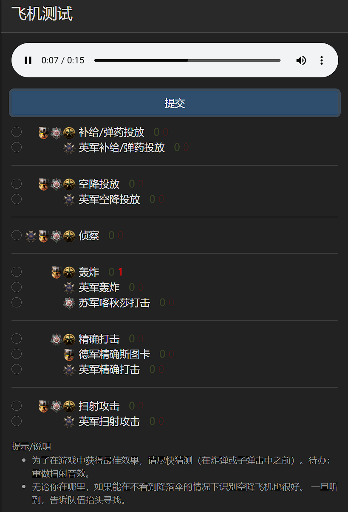
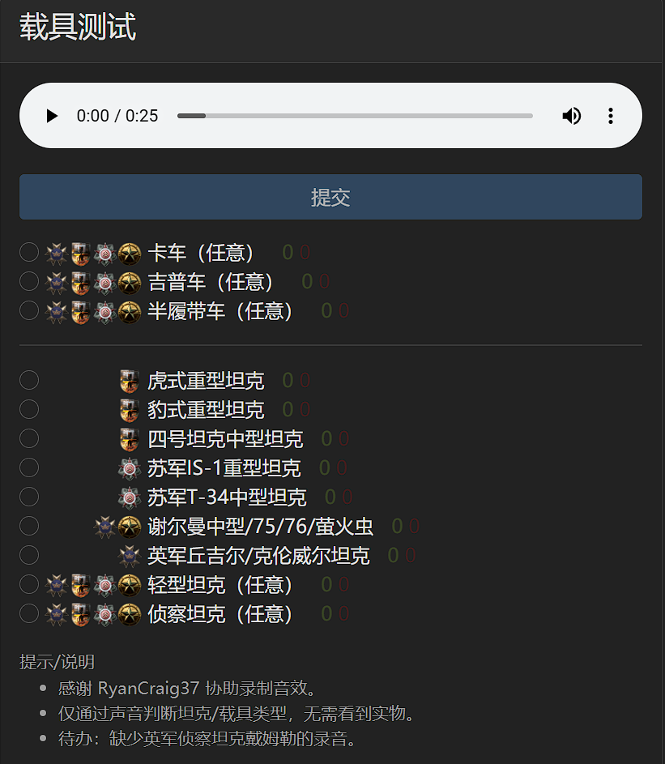

# 人间地狱音效库

**发布日期：** 2025年8月3日  
**作者：** 陈家辉  
**分类：** 技术分享
**标签：** Hell let loose, 音效库

## 摘要

本网站[https://sounds.yuanxunfang.top/](https://sounds.yuanxunfang.top/) 主要提供了《人间地狱》这款游戏的指挥官技能音效以及各种载具音效，主要用于锻炼车组和步兵判断指挥官技能和载具类型的能力，支持国内访问加速。

## 项目来源

项目来自于github上的开源项目mattwright324/hll-sound-guide，本网站对于该开源项目进行了二次开发，提供了中文的友好界面。。更多信息可以参见我的github项目源码，[https://github.com/chenjiahui-offical/hll-sound-guide.git](https://github.com/chenjiahui-offical/hll-sound-guide.git)

## 网站界面

当前的网页分为飞机音效（指挥技能）和载具音效

### 飞机参考 

> 当前展示了各个阵营的不同指挥官技能的飞机音效，点击三角播放键即可开始播放音效。

![播放选项截图]](../post_images/post3/3.png)
> 点击禁音键旁边的播放选项键可以选择下载音源或者调整播放倍速

### 飞机测试

> 在飞机测试界面会随机播放一个音效，用户可在下方选项中选择自己的答案并提交，提交后会返回答案，同时会刷新重置另一个音效进行播放。在下方的选项中会对于测试结果进行统计，红色为错误次数，绿色为正确次数。

### 载具参考

> 在载具参考界面中展示了各个阵营的各个载具的音效，包含行驶音效和射击音效，对于坦克射击音效为炮击，对于半履带射击音效为机枪，

### 载具测试

> 当前在载具测试界面会随机播放一个载具行驶音效用户可在下方选项中选择自己的答案并提交，提交后会返回答案，同时会刷新重置另一个音效进行播放。在下方的选项中会对于测试结果进行统计，红色为错误次数，绿色为正确次数。

## 总结

本文主要介绍了[https://sounds.yuanxunfang.top/](https://sounds.yuanxunfang.top/) 该网站，即HLL音效库，包括了各种指挥技能音效和载具音效。旨在为人间地狱CN社区的玩家提高战场感知度，熟悉游戏内音效。

---

**导航：**
- [← 上一篇](post2.html)
- [返回博客列表](index.html)
- 下一篇 →（暂无）