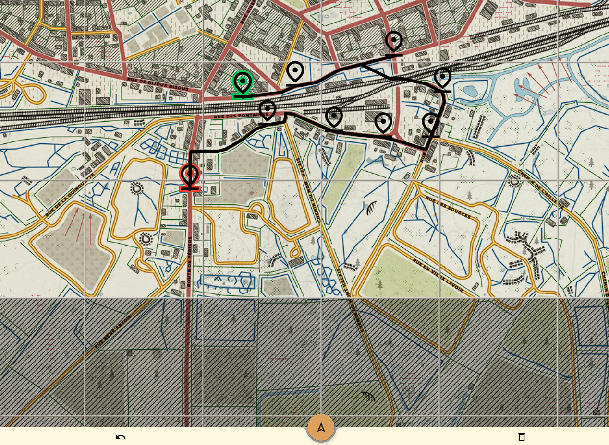

# 人间地狱交互式驾驶路线

**发布日期：** 2025年8月5日  
**作者：** 陈家辉  
**分类：** 技术分享
**标签：** Hell let loose, 驾驶路线

## 摘要

本网站[https://drive.yuanxunfang.top/](https://drive.yuanxunfang.top/) 主要提供了《人间地狱》这款游戏不同地图的交互式驾驶路线生成，仅需在地图上点击即可直接生成驾驶路线，支持国内访问加速。

## 项目来源

项目来自于[https://worldwarways.web.app/](https://worldwarways.web.app/)，本网站对于该项目进行了二次开发，提供了中文的友好界面。。更多信息可以参见我的github项目源码，[https://github.com/chenjiahui-offical/HLL_drive.git](https://github.com/chenjiahui-offical/HLL_drive.git)

## 网站界面

当前的左上角为菜单栏，进入网站后默认地图为卡朗唐。

### 菜单界面 

> 菜单栏点击地图名即可选择不同地图，（开发中）标明当前该地图仅提供查看功能，不支持路线规划

### 路线规划

> 按住地图即可实现地图拖拽。单击地图会生成坐标点，默认以第一个坐标点为起始点，最后一个坐标点为终点。

> 确定好坐标点后，点击正下方中间的三角标即可开始规划路线，系统会自动生成从起点到终点的路线，确保依次经过每一个坐标点。点击正下方左侧的撤销键，即可退回上一步。点击正下方右侧的清除键，即可一键清空地图。

## 总结

本文主要介绍了[https://drive.yuanxunfang.top/](https://drive.yuanxunfang.top/) 该网站，即HLL交互式驾驶路线，支持提供不同地图的驾驶路线智能规划，望人间地狱CN社区更进一步！。

## 打赏

> 汉化+二次开发不易，CDN+网站为自费搭建，只为国内用户能有友好的访问体验，打赏自愿
---

**导航：**
- [← 上一篇](post3.html)
- [返回博客列表](index.html)
- [下一篇 →](post5.html)